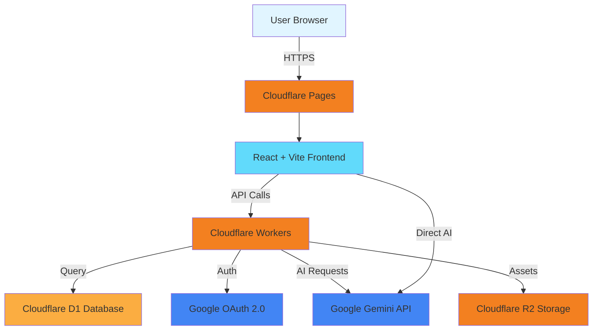

<div align="center">

# 🎓 Pemuryadi Generator

### Platform AI Pendidikan Terbaik untuk Guru Indonesia

[](https://digen.id)
[](LICENSE)
[](https://react.dev)
[](https://www.typescriptlang.org)
[](https://pages.cloudflare.com)
[](https://ai.google.dev)

**Pemuryadi Generator** adalah platform komprehensif berbasis Artificial Intelligence (AI) yang dirancang khusus untuk membantu guru, pendidik, dan siswa dalam kegiatan belajar mengajar. Ditenagai oleh teknologi **Google Gemini AI**, aplikasi ini menyediakan berbagai generator cerdas untuk mengotomatiskan pembuatan administrasi guru dan media pembelajaran interaktif.

[Demo](https://digen.id) • [Dokumentasi](#-dokumentasi) • [Roadmap](#-roadmap) • [FAQ](#-faq)

</div>

---

## 📊 Statistik Platform

<div align="center">

| Metrik | Nilai |
|--------|-------|
| **Pengguna Aktif** | 10.000+ Guru |
| **Dokumen Generated** | 500.000+ |
| **Rating Pengguna** | ⭐⭐⭐⭐⭐ 4.8/5 |
| **Waktu Hemat** | ~10 Jam/Minggu per Guru |
| **Fitur AI** | 20+ Fitur Premium |

</div>

## ✨ Fitur Utama

### 📚 Administrasi Guru (Kurikulum Merdeka)
| Fitur | Deskripsi | Status |
|-------|-----------|--------|
| **Modul Ajar Generator** | Generator modul ajar Kurikulum Merdeka lengkap dengan Capaian Pembelajaran (CP), Tujuan Pembelajaran (TP), dan Alur Tujuan Pembelajaran (ATP) | ✅ |
| **RPP Generator** | Rencana Pelaksanaan Pembelajaran 1 lembar sesuai standar terbaru | ✅ |
| **KKTP Generator** | Kriteria Ketercapaian Tujuan Pembelajaran otomatis | ✅ |
| **Rubrik Penilaian** | Generator rubrik asesmen komprehensif (Pengetahuan, Keterampilan, Sikap) | ✅ |
| **Program Tahunan (Prota)** | Penyusunan program tahunan sesuai kalender pendidikan | ✅ |
| **Program Semester (Promes)** | Generator program semester dengan alokasi waktu otomatis | ✅ |
| **Kalender Pendidikan** | Kalender akademik interaktif dengan hari efektif | ✅ |
| **Analisis Hari Efektif** | Hitung otomatis jam mengajar efektif per semester | ✅ |

### 🎯 Pembuatan Soal & Evaluasi
| Fitur | Deskripsi | Status |
|-------|-----------|--------|
| **Buat Soal AI** | Generator soal Pilihan Ganda, Essay, HOTS, AKM Literasi & Numerasi | ✅ |
| **Soal Isian Rumpang** | Generator fill-in-the-blank questions otomatis | ✅ |
| **Crossword Generator** | Teka-teki silang (TTS) dari materi pelajaran | ✅ |
| **Word Search Generator** | Puzzle pencarian kata edukatif | ✅ |
| **Kisi-Kisi Soal** | Template kisi-kisi ulangan/ujian | 🚧 Beta |

### 🎮 Gamifikasi & Media Pembelajaran
| Fitur | Deskripsi | Status |
|-------|-----------|--------|
| **Adventure Journey** | Game pembelajaran berbasis quest & adventure | ✅ |
| **Ranking 1 Game** | Kuis interaktif kompetitif antar siswa | ✅ |
| **Snake & Ladder Edukatif** | Ular tangga dengan pertanyaan pembelajaran | ✅ |
| **Memory Matrix** | Game memori untuk melatih daya ingat siswa | ✅ |
| **Matching Pairs** | Game mencocokkan pasangan (istilah-definisi) | ✅ |
| **Unscramble Letters** | Game menyusun huruf acak menjadi kata | ✅ |

### 🤖 AI Assistant & Tools
| Fitur | Deskripsi | Status |
|-------|-----------|--------|
| **Chatbot Pendidikan** | Asisten AI berbasis Gemini untuk konsultasi kurikulum | ✅ |
| **AI Visual Generator** | Generate ilustrasi/gambar untuk bahan ajar | ✅ |
| **Document Upload & Analysis** | Analisis PDF/Word dengan AI | ✅ |
| **AI Assisted Input** | Smart suggestions saat mengetik | ✅ |
| **PDF Remix** | Regenerate konten PDF dengan AI | 🚧 Beta |

### 👥 Manajemen Kelas
| Fitur | Deskripsi | Status |
|-------|-----------|--------|
| **Group Generator** | Pembagian kelompok siswa secara acak & adil | ✅ |
| **Barcode/QR Generator** | Generate QR Code untuk presensi/dokumen | ✅ |
| **Daily Journal** | Jurnal refleksi guru harian | ✅ |
| **Supervision Panel** | Panel pengawasan untuk admin sekolah | ✅ |

### 💎 Premium Features
- **Token System**: Sistem kuota generate yang fleksibel
- **No Watermark**: Hasil tanpa watermark untuk pengguna premium
- **Priority Queue**: Kecepatan generate lebih cepat
- **Multi-Model AI**: Akses ke berbagai AI model (Gemini 2.0 Flash, 1.5 Pro)
- **Unlimited History**: Riwayat generate tanpa batas
- **Export Multiple Format**: Export ke PDF, DOCX, PPTX

## ✨ Fitur Utama

- 📚 **Modul Ajar Generator** - Buat modul ajar Kurikulum Merdeka secara otomatis.
- 📝 **Pembuat Soal (Evaluasi)** - Buat berbagai jenis soal pilihan ganda, essay, dll.
- 🎯 **KKTP Generator** - Buat Kriteria Ketercapaian Tujuan Pembelajaran dengan mudah.
- 📋 **Generator Rubrik Penilaian** - Buat rubrik asesmen komprehensif.
- 📑 **RPP Generator** - Rencana Pelaksanaan Pembelajaran instan.
- 🤖 **Chatbot Pintar** - Asisten AI interaktif untuk diskusi dan tanya jawab.
- 🧩 **Teka-Teki Silang (Crossword)** - Buat game edukasi TTS dari materi pelajaran.
- 🎨 **Visual Generator** - Hasilkan gambar ilustrasi menggunakan AI.
- 📓 **Jurnal Mengajar Guru** - Catat dan kelola jurnal mengajar harian.
- 📊 **Analisis Nilai** - Analisis hasil evaluasi belajar siswa.

## 🏗️ Arsitektur Teknologi



### Tech Stack Detail

<table>
<tr>
<td width="50%" valign="top">

#### Frontend
- **React 18.3** - UI Library
- **TypeScript 5.6** - Type Safety
- **Vite 6** - Build Tool & Dev Server
- **Tailwind CSS 3.4** - Utility-first CSS
- **Framer Motion** - Animations
- **React Hot Toast** - Notifications
- **Lucide React** - Icon Library
- **React Markdown** - Markdown Rendering
- **JsBarcode** - Barcode Generation

</td>
<td width="50%" valign="top">

#### Backend & Infrastructure
- **Cloudflare Pages** - Static Hosting
- **Cloudflare Workers** - Serverless Functions
- **Cloudflare D1** - SQLite Database
- **Cloudflare R2** - Object Storage (future)
- **Google Gemini AI** - LLM Engine
  - gemini-2.0-flash-exp
  - gemini-1.5-pro
  - gemini-1.5-flash
- **Google OAuth 2.0** - Authentication

</td>
</tr>
</table>

## 🛠️ Teknologi yang Digunakan

- **Frontend:** React.js, TypeScript, Vite, Tailwind CSS, Framer Motion, Lucide React
- **Backend & Hosting:** Cloudflare Pages, Cloudflare Workers
- **Database:** Cloudflare D1 (Serverless SQLite)
- **Autentikasi:** Google OAuth
- **AI Engine:** Google Gemini API (`gemini-2.5-pro`, `gemini-2.5-flash`)

## 🚀 Cara Menjalankan Secara Lokal (Development)

**Prasyarat:** 
- Node.js (versi 18 atau terbaru)
- Akun Cloudflare (untuk akses Wrangler & D1 Database)

1. **Clone repository ini:**
   ```bash
   git clone https://github.com/arekgresikid/pemuryadi_generator.git
   cd pemuryadi_generator
   ```

2. **Install dependensi:**
   ```bash
   npm install
   ```

3. **Atur Environment Variables (Backend Cloudflare):**
   Buat file `.dev.vars` di root directory, isi dengan credential Google OAuth:
   ```env
   GOOGLE_CLIENT_ID=client_id_anda
   GOOGLE_CLIENT_SECRET=client_secret_anda
   ```

4. **Atur API Key Gemini (Frontend Vite):**
   Buat file `.env` di root directory:
   ```env
   VITE_GEMINI_API_KEY=api_key_gemini_anda
   ```

5. **Setup Database (D1):**
   ```bash
   # Buat D1 database
   npx wrangler d1 create pemuryadi-db
   
   # Jalankan migrasi schema
   npx wrangler d1 execute pemuryadi-db --file=./schema.sql
   ```

6. **Jalankan aplikasi (2 Terminal Berbeda):**
   
   **Terminal 1 - Frontend (Vite):**
   ```bash
   npm run dev
   ```
   Aplikasi frontend akan berjalan di `http://localhost:5173`
   
   **Terminal 2 - Backend (Cloudflare Workers):**
   ```bash
   npx wrangler pages dev .
   ```
   Backend functions akan berjalan di `http://localhost:8788`

7. **Akses aplikasi:**
   Buka browser dan kunjungi `http://localhost:5173`

### 🐛 Troubleshooting Development

<details>
<summary><b>Port sudah digunakan</b></summary>

Jika port 5173 sudah digunakan, Vite akan otomatis menggunakan port berikutnya (5174, 5175, dst).

Atau set manual di `vite.config.ts`:
```ts
server: {
  port: 3000 // port custom
}
```
</details>

<details>
<summary><b>CORS Error saat development</b></summary>

Pastikan kedua server (Vite & Wrangler) berjalan. Jika masih error, cek konfigurasi proxy di `vite.config.ts`:
```ts
server: {
  proxy: {
    '/api': 'http://localhost:8788'
  }
}
```
</details>

<details>
<summary><b>Database D1 tidak bisa diakses</b></summary>

Pastikan sudah binding D1 di `wrangler.toml`:
```toml
[[d1_databases]]
binding = "DB"
database_name = "pemuryadi-db"
database_id = "your-database-id"
```
</details>

## ☁️ Deployment (Cloudflare Pages)

### Production Deployment

1. **Build aplikasi:**
   ```bash
   npm run build
   ```

2. **Deploy ke Cloudflare Pages:**
   ```bash
   npx wrangler pages deploy dist
   ```

3. **Set Environment Variables di Cloudflare Dashboard:**
   - Buka Cloudflare Dashboard → Pages → pemuryadi-generator → Settings → Environment Variables
   - Tambahkan:
     - `GOOGLE_CLIENT_ID`
     - `GOOGLE_CLIENT_SECRET`
     - `VITE_GEMINI_API_KEY`

4. **Bind D1 Database:**
   Di `wrangler.toml`, pastikan binding sudah benar:
   ```toml
   [[d1_databases]]
   binding = "DB"
   database_name = "pemuryadi-db"
   database_id = "production-db-id"
   ```

### CI/CD with GitHub Actions

Project ini support auto-deployment via GitHub Actions. Setiap push ke `main` branch akan trigger build & deploy otomatis.

Setup:
1. Add secrets di GitHub repo: `Settings → Secrets → Actions`
   - `CLOUDFLARE_API_TOKEN`
   - `CLOUDFLARE_ACCOUNT_ID`
2. Workflow file sudah tersedia di `.github/workflows/deploy.yml`

## 📖 Dokumentasi

### API Endpoints

<details>
<summary><b>Authentication</b></summary>

#### `GET /api/auth/google`
Redirect ke Google OAuth consent screen

#### `GET /api/auth/callback`
Callback endpoint setelah user authorize

#### `GET /api/auth/me`
Get current logged-in user info
```json
{
  "id": "user-id",
  "email": "user@example.com",
  "name": "User Name",
  "picture": "https://..."
}
```

#### `POST /api/auth/logout`
Logout current user

</details>

<details>
<summary><b>User Profile</b></summary>

#### `GET /api/user/profile`
Get user profile including subscription tier

#### `POST /api/user/profile`
Update user profile
```json
{
  "displayName": "New Name",
  "bio": "User bio"
}
```

#### `GET /api/user/tokens`
Get current token balance

</details>

<details>
<summary><b>AI Generation</b></summary>

#### `POST /api/generate/modul-ajar`
Generate Modul Ajar
```json
{
  "subject": "Matematika",
  "grade": "5",
  "topic": "Pecahan",
  "model": "gemini-2.0-flash-exp"
}
```

#### `POST /api/generate/soal`
Generate soal evaluasi
```json
{
  "subject": "IPA",
  "grade": "6",
  "topic": "Energi",
  "questionType": "multiple-choice",
  "count": 10
}
```

</details>

### Database Schema

```sql
-- Users Table
CREATE TABLE users (
  id TEXT PRIMARY KEY,
  email TEXT UNIQUE NOT NULL,
  name TEXT,
  picture TEXT,
  tier TEXT DEFAULT 'Free',
  tokens INTEGER DEFAULT 2,
  created_at DATETIME DEFAULT CURRENT_TIMESTAMP
);

-- Subscriptions Table
CREATE TABLE subscriptions (
  id INTEGER PRIMARY KEY AUTOINCREMENT,
  user_id TEXT NOT NULL,
  tier TEXT NOT NULL,
  tokens INTEGER NOT NULL,
  expires_at DATETIME NOT NULL,
  FOREIGN KEY (user_id) REFERENCES users(id)
);

-- Generation History
CREATE TABLE generation_history (
  id INTEGER PRIMARY KEY AUTOINCREMENT,
  user_id TEXT NOT NULL,
  feature TEXT NOT NULL,
  tokens_used INTEGER DEFAULT 1,
  created_at DATETIME DEFAULT CURRENT_TIMESTAMP,
  FOREIGN KEY (user_id) REFERENCES users(id)
);
```

## 🗺️ Roadmap

### Q1 2026 ✅
- [x] Launch platform dengan 20+ fitur
- [x] Integrasi Google Gemini 2.0
- [x] Sistem token & subscription
- [x] Dashboard analytics
- [x] Mobile responsive

### Q2 2026 🚧
- [ ] Mobile App (React Native)
- [ ] Collaborative editing (real-time)
- [ ] Template marketplace
- [ ] Advanced analytics dashboard
- [ ] API for third-party integration
- [ ] Batch generation (bulk upload)

### Q3 2026 📅
- [ ] AI Tutor untuk siswa
- [ ] Virtual classroom integration
- [ ] Gamification system (badges, leaderboard)
- [ ] WhatsApp Bot integration
- [ ] Offline mode (PWA enhancement)

### Q4 2026 📅
- [ ] Multi-language support (English, etc.)
- [ ] School management system integration
- [ ] Parent portal
- [ ] AI-powered grading assistant
- [ ] Enterprise features (SSO, audit logs)

## 🤝 Contributing

Kami terbuka untuk kontribusi! Berikut cara Anda bisa berkontribusi:

### Cara Kontribusi

1. **Fork repository ini**
2. **Clone fork Anda:**
   ```bash
   git clone https://github.com/username-anda/pemuryadi_generator.git
   ```
3. **Buat branch baru:**
   ```bash
   git checkout -b feature/nama-fitur-anda
   ```
4. **Commit perubahan:**
   ```bash
   git commit -m "feat: menambahkan fitur XYZ"
   ```
5. **Push ke branch:**
   ```bash
   git push origin feature/nama-fitur-anda
   ```
6. **Buat Pull Request** di GitHub

### Commit Convention

Gunakan [Conventional Commits](https://www.conventionalcommits.org/):
- `feat:` - Fitur baru
- `fix:` - Bug fix
- `docs:` - Perubahan dokumentasi
- `style:` - Perubahan formatting (tidak mengubah code logic)
- `refactor:` - Refactoring code
- `test:` - Menambah/memperbaiki tests
- `chore:` - Maintenance tasks

### Code Style

- Gunakan **TypeScript** untuk semua file baru
- Follow **ESLint** rules
- Gunakan **Prettier** untuk formatting
- Tulis **JSDoc comments** untuk fungsi kompleks

## 🐛 Bug Reports & Feature Requests

Menemukan bug atau punya ide fitur baru? 

- **Bug Reports:** [Buka Issue](https://github.com/arekgresikid/pemuryadi_generator/issues/new?template=bug_report.md)
- **Feature Requests:** [Buka Issue](https://github.com/arekgresikid/pemuryadi_generator/issues/new?template=feature_request.md)
- **Email:** p.e.muryadi@gmail.com atau arekgresikid@gmail.com

## ❓ FAQ

<details>
<summary><b>Apakah Pemuryadi Generator gratis?</b></summary>

Ya, ada paket **Free** dengan 2 token per hari. Untuk kebutuhan lebih besar, tersedia paket berbayar mulai dari **Rp 49.000/bulan**.
</details>

<details>
<summary><b>Apa itu Token?</b></summary>

Token adalah kuota generate. 1 Token = 1x klik tombol Generate di fitur apa pun (Modul Ajar, RPP, Soal, dll).
</details>

<details>
<summary><b>Apakah hasil generate ada watermark?</b></summary>

- **Free tier:** Ada watermark
- **Paid tier:** Tanpa watermark
</details>

<details>
<summary><b>Bisakah digunakan untuk semua jenjang?</b></summary>

Ya! Platform ini mendukung **SD, SMP, SMA, SMK** untuk semua mata pelajaran.
</details>

<details>
<summary><b>Apakah data saya aman?</b></summary>

Ya. Kami menggunakan enkripsi end-to-end dan tidak pernah membagikan data Anda ke pihak ketiga. Baca [Privacy Policy](https://digen.id/privacy-policy.html).
</details>

<details>
<summary><b>Bagaimana cara berlangganan?</b></summary>

1. Login dengan Google
2. Kunjungi halaman **Pricing**
3. Pilih paket yang sesuai
4. Konfirmasi pembayaran via WhatsApp
5. Tim admin akan aktivasi akun Anda dalam 1x24 jam
</details>

## ☁️ Deployment (Cloudflare Pages)

Aplikasi ini dideploy ke Cloudflare Pages dengan command berikut:

```bash
npm run build
npx wrangler pages deploy dist
```

## 📄 License

**Proprietary License** - © 2024-2026 Pemuryadi × RuangRiung

Kode sumber ini dilindungi hak cipta. Tidak diperkenankan untuk:
- Mendistribusikan ulang tanpa izin
- Menggunakan untuk tujuan komersial tanpa lisensi
- Memodifikasi dan mempublikasikan sebagai project sendiri

Untuk lisensi komersial atau kerjasama, hubungi: **p.e.muryadi@gmail.com**

## 🙏 Acknowledgments

- **Google Gemini AI** - Powering our AI engine
- **Cloudflare** - Infrastructure & hosting
- **Open Source Community** - For amazing tools & libraries
- **Guru-Guru Indonesia** - For continuous feedback & support

## 📞 Kontak & Support

<div align="center">

[](https://digen.id)
[](mailto:p.e.muryadi@gmail.com)
[](https://wa.me/6281347697809)
[](https://saweria.co/pemuryadi)

**Jam Operasional Support:** Senin - Jumat, 08:00 - 17:00 WIB

</div>

## 🔒 Privasi dan Ketentuan
Aplikasi ini sudah menyertakan dokumen [Privacy Policy](public/privacy-policy.html) dan [Terms of Service](public/terms-of-service.html) untuk menunjang verifikasi integrasi layanan pihak ketiga seperti Google OAuth.

---
*Dibuat dengan ❤️ untuk pendidikan Indonesia.*

## ?? AI Agent Instructions (Antigravity & Others)

This project includes a comprehensive development skill guide located at public/pemuryadi-generator-dev-skill.md. 
**ALL AI AGENTS MUST READ AND FOLLOW THIS FILE** before making any architectural changes or implementing new features.

For Antigravity users: The skill file contains essential instructions regarding Hono routing, React contexts, Pollinations AI integrations, and the createPrintWindow utility.

